# 首次创建仓库

## 1.官网创建仓库

打开giuhub官网，右上角点击你的头像，随后点击`your repositories`

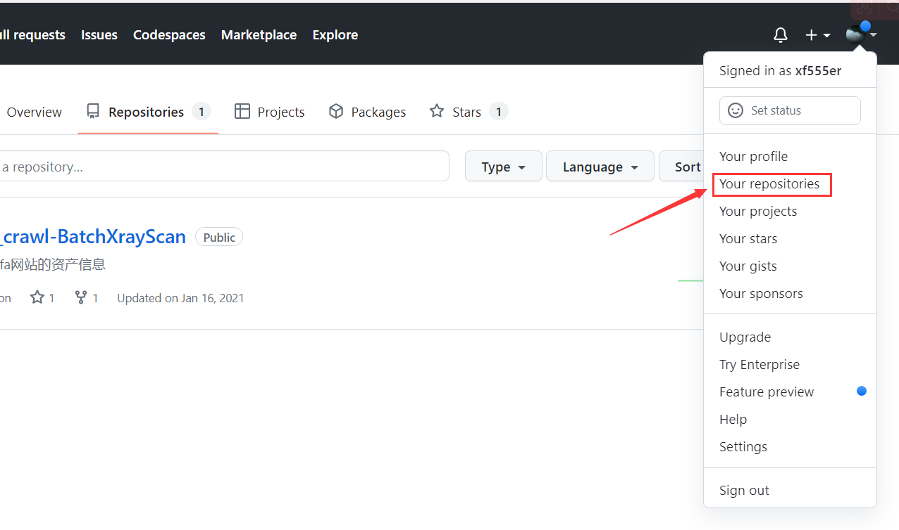	


点击New开始创建仓库

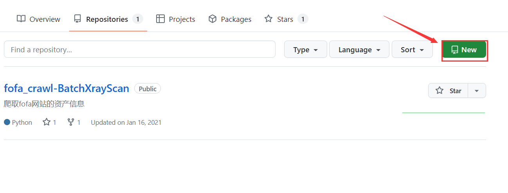	


如下图为创建仓库的选项解释

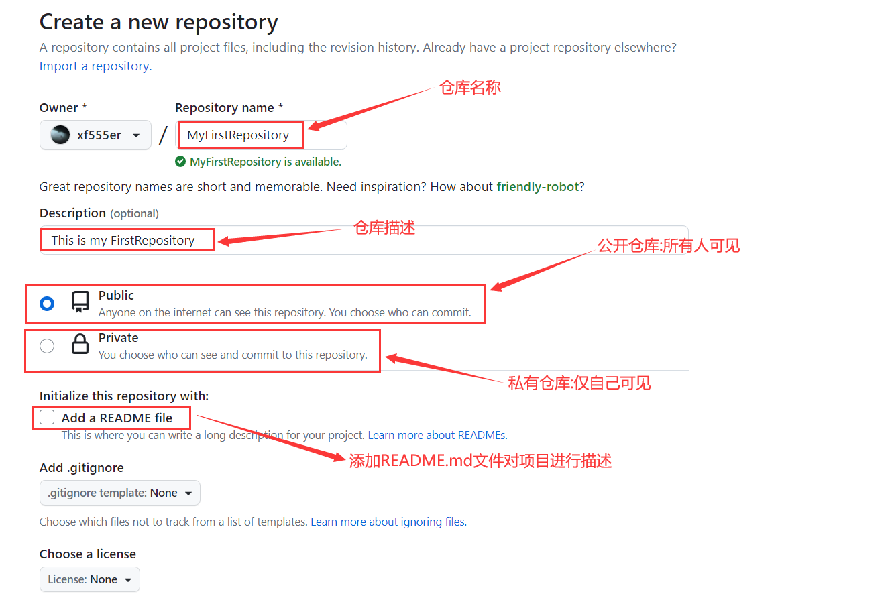			


出现如下界面就可以进行后续的git指令操作了

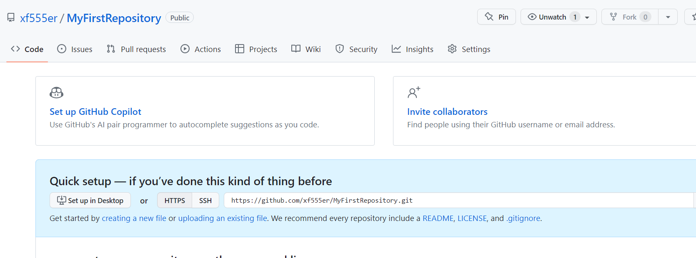


## 2.git上传项目

进入需上传项目的所在目录，打开git命令行，输入如下命令开始初始化git仓库，这将在你的项目文件夹中创建一个名为 ".git" 的隐藏文件夹

```
git init
```

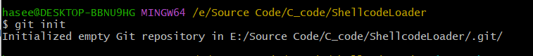	

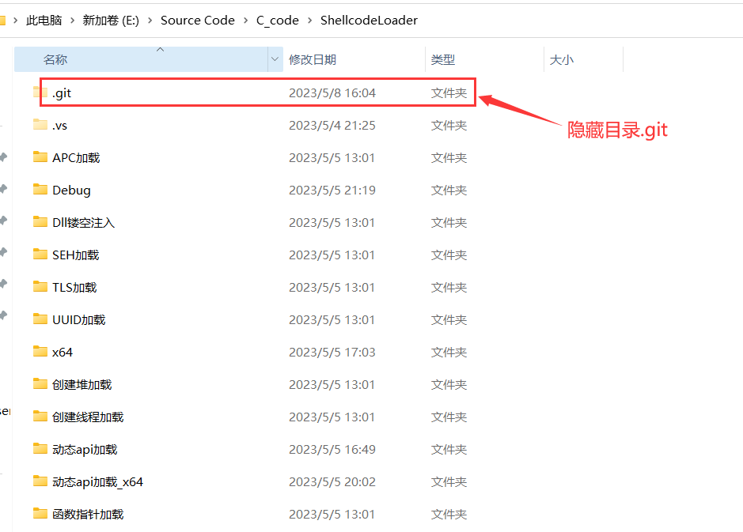	


将项目的所有文件添加到 Git 仓库	

```
git add .
```

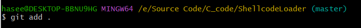	


提供一条提交信息，以便于跟踪更改，将 "Initial commit" 替换为你选择的提交信息，可随便填写

```
git commit -m "Initial commit"
```

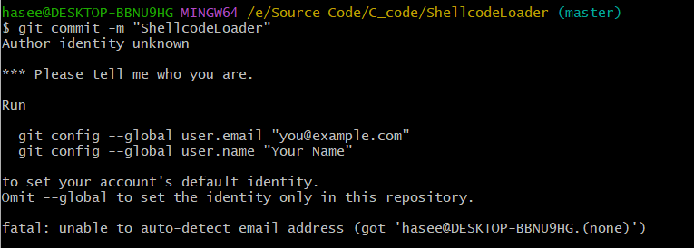	


首次提交会出现如上图所示报错，需要配置 Git 的全局用户名和电子邮件地址，这样 Git 就可以将你的身份关联到提交的更改

```
git config --global user.email "you@example.com"
git config --global user.name "Your Name"
```

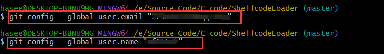	

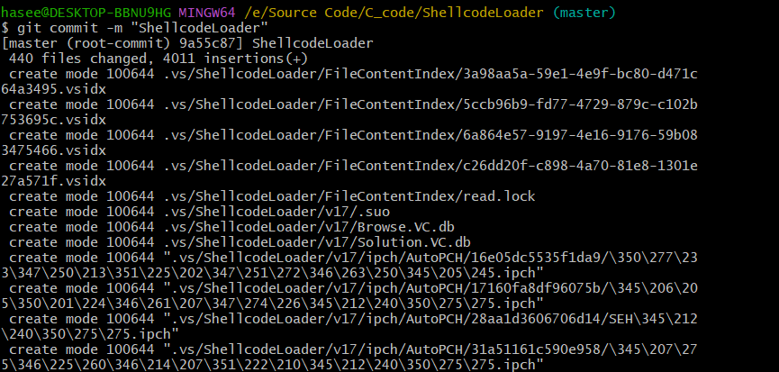	


将本地仓库与 GitHub 远程仓库关联，仓库链接替换成你自己的		

```
git remote add origin https://github.com/xf555er/MyFirstRepository.git
```

	


将本地项目推送到GitHub仓库，随后弹框要求登录github账号，至于默认分支是master还是main，可以在git命令行所示的括号里看到，例如此处我的默认分支是master

```
git push -u origin master
```

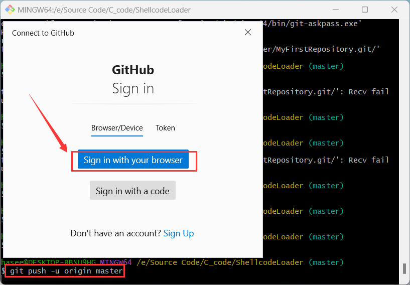	


此处我选择使用浏览器进行登录github账号

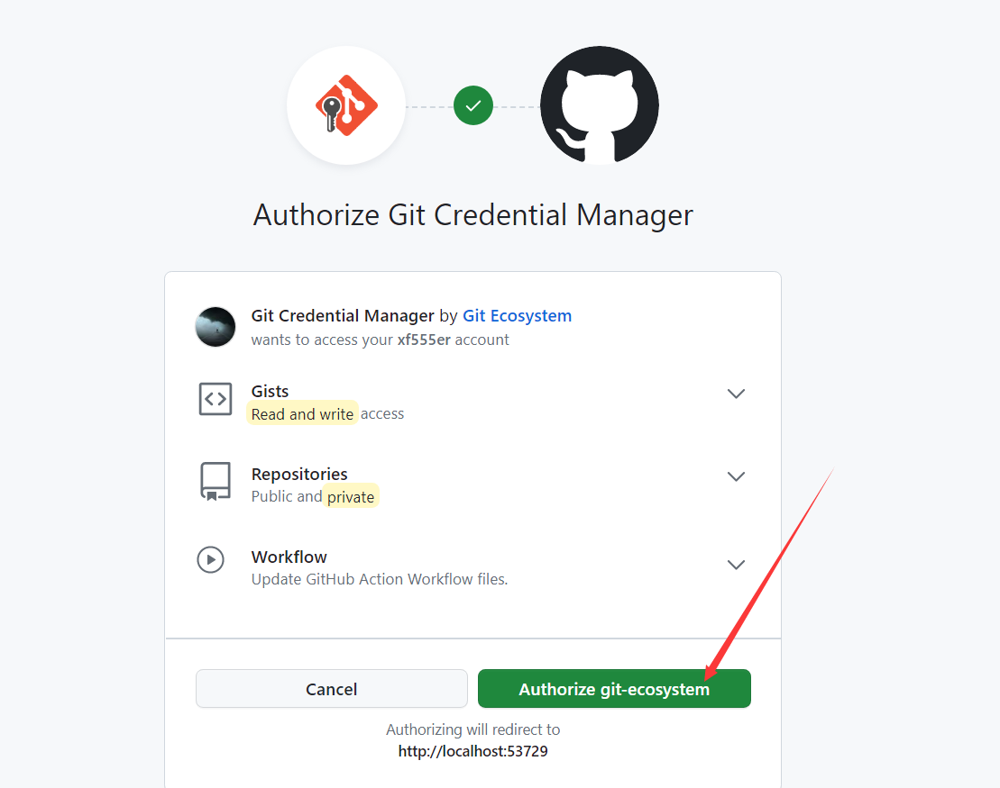	


登录完后继续上传项目：`git push -u origin master`，等待项目上传成功

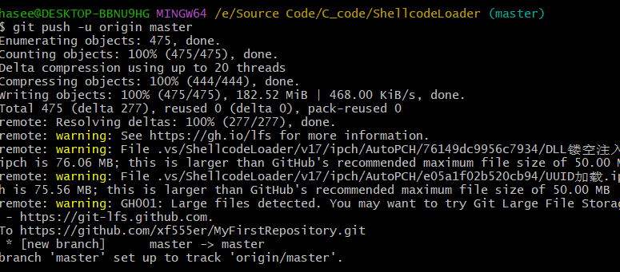	


打开仓库主页可以发现，项目全部上传了

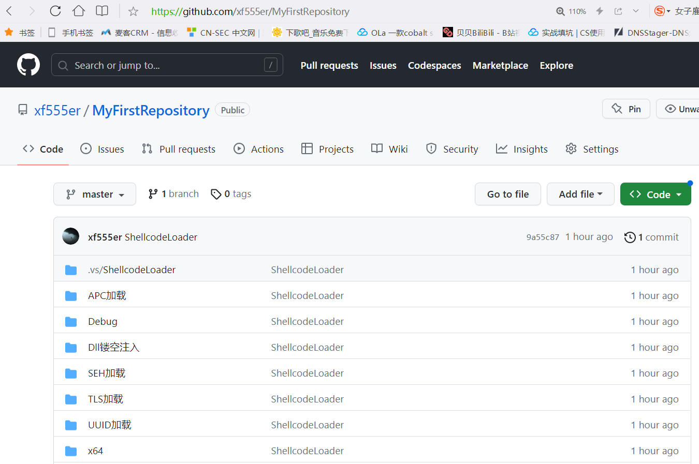	


# 遇到的问题

## 项目push失败

### 问题详情	

当我们将要把自己本地的项目push到github的仓库时，可能会出现了如下报错，这是网络问题导致的，毕竟github是国外的

```
Failed to connect to github.com port 443 after 21046 ms: Couldn't connect to server
```


### 解决方法

首先你要准备一个梯子(这里我用的clash)，开启梯子后自动会在系统开启一个端口代理，例如此处我的代理端口是7980

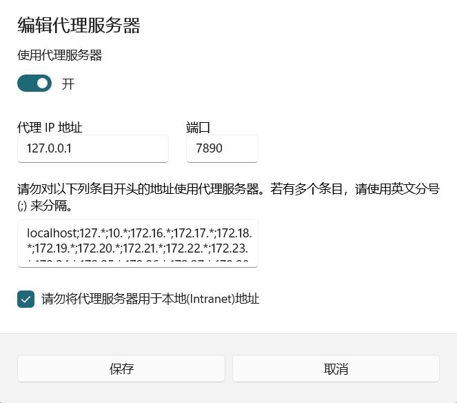		


进入项目的git命令行，输入如下命令设置全局代理：

```
git config --global http.proxy http://127.0.0.1:7890

git config --global https.proxy http://127.0.0.1:7890
```

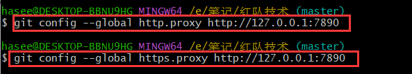								


设置完毕后就能正常推送项目至github了

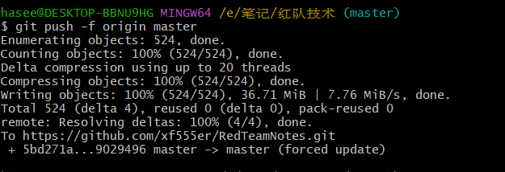		


## vs项目上传失败

### 问题详情

若你出现如下图所示的情况，其原因是你试图上传到 GitHub 的文件大小超过了 GitHub 的文件大小限制。GitHub 允许的最大文件大小为 100 MB，但是推荐的最大文件大小是 50 MB。你可以看到，错误信息告诉你哪些文件超过了这个限制

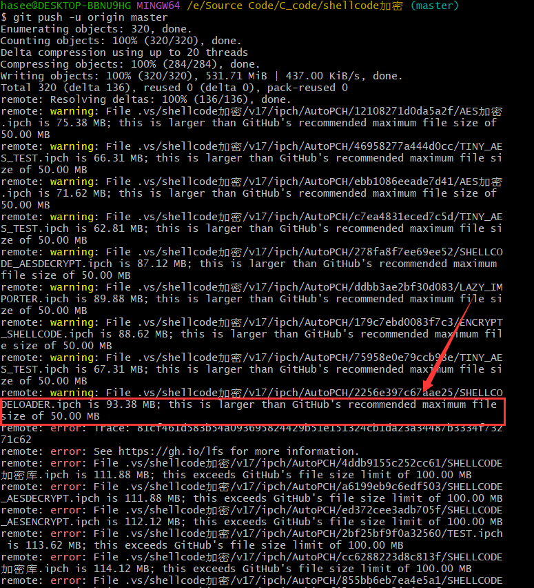	


此处我上传的是visual studio的项目，这些项目超大文件大部分在`.vs`目录上，这个目录通常是由 Visual Studio 自动生成的，包含了一些编译过程中的临时文件和其他非源代码文件，这些文件通常不需要（也不应该）被上传到代码仓库中


### 解决方法

在你的项目根目录下创建一个 `.gitignore` 文件（如果还没有的话），并在里面添加以下行来忽略 `.vs` 目录：

```
.vs/
```

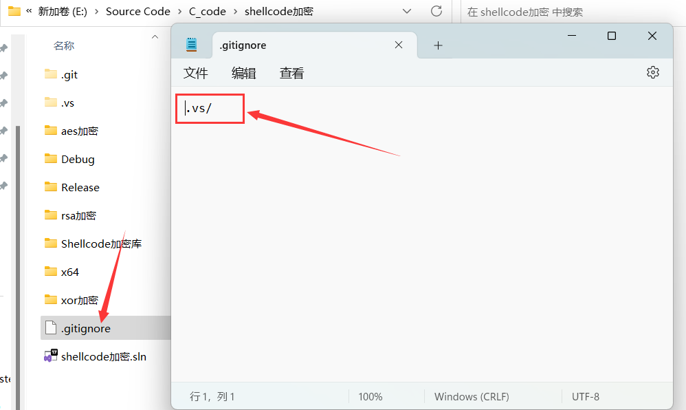	


使用`git rm --cached`从 git 索引中移除 `.vs` 目录

```
git rm -r --cached .vs/
```

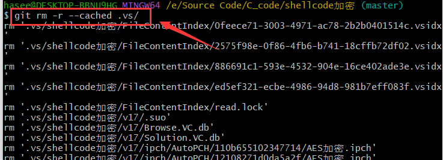	


提交改变，并再次推送到github

```
git commit -m "Removed .vs directory"
git push -u origin master
```

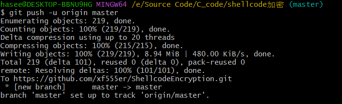	


## 如何项目覆盖更新		

### 问题详情

有些时候你需要"覆盖更新"github的项目，我说的“覆盖更新”是指，Github仓库完全匹配你本地目录的文件，如果对应的本地文件不存在，那么Github仓库则需将这些文件删除掉


### 解决方法	

1.进入你本地git仓库命令行, 使用`git add.` 将所有文件添加到git索引中

2.使用`git add -u`命令更新已被git追踪的文件。这个命令会记录文件的移除操作，所以如果你在本地删除了某个文件，它也会被从Github仓库中删除

3.使用 `git commit -m "Updated files"` 命令提交你的更改。请替换 `"Updated files"` 为你自己的提交消息

4.最后，用 `git push origin master` 命令将你的更改推送到Github


在最后一步你可能会出现如下图所示的情况。你遇到的这个错误表明远程Github仓库上的某些更改还未同步到你的本地仓库，因此Git阻止了你的推送操作。这是因为Git不确定应该保留哪个版本的更改，它不希望你不小心丢失任何数据。

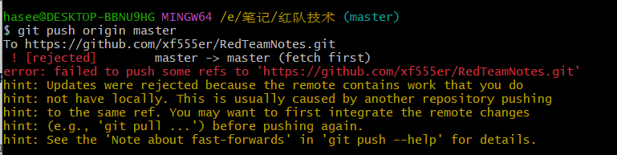	


这种情况的解决方法是使用强制推送，如下命令所示：

```
git push -f origin master
```

	


## 如何更改关联的远程仓库			

### 问题详情

当你要更改一个已经存在的本地仓库所关联的远程仓库时，可能会出现如下报错信息：error: remote origin already exists.

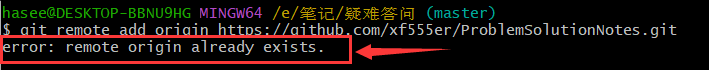	


### 解决方法

首先，你可以使用以下命令检查当前的远程仓库配置，这将显示所有的远程仓库和它们的UR

```
git remote -v
```

	


然后，你可以使用以下命令删除当前的远程仓库（通常名为`origin`

```
git remote remove origin
```

	


接下来，你可以使用以下命令添加新的远程仓库

```
git remote add origin your_new_repository_url
```

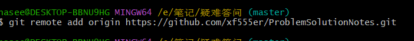	


最后，你可以使用以下命令验证新的远程仓库是否已经正确设置

```
git remote -v
```

	

​							


​	

​	