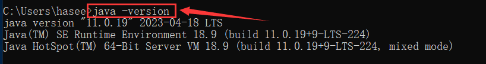
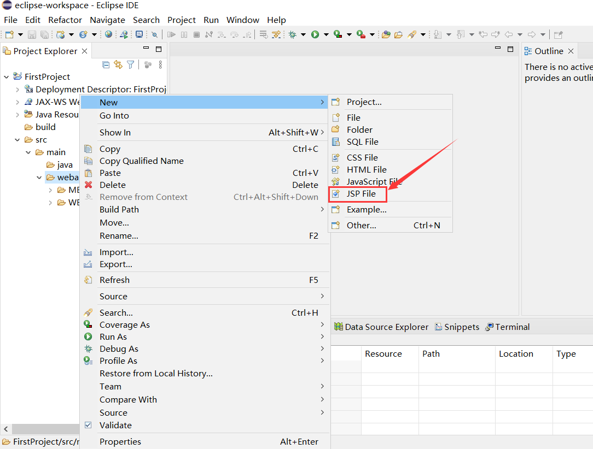

# 简介

Java Server Pages (JSP) 是一种由 Sun Microsystems 开发的用于创建动态网页的技术。它是 Java EE (Java Enterprise Edition) 技术的一部分，允许开发者在 HTML 中嵌入 Java 代码，从而实现动态内容的生成。

JSP 主要由两部分组成：静态数据和 JSP 元素。静态数据可以是任何类型的文本，包括 HTML、XML、SVG 等，而 JSP 元素是一些用于生成动态内容的特殊标记。

# 准备工作

- [JDK下载](https://www.oracle.com/technetwork/java/javase/downloads/index.html)
- [Tomcat下载](https://tomcat.apache.org/download-90.cgi#9.0.11)
- [Eclipse下载](http://www.eclipse.org/downloads/)

# 一、JAVA环境配置

## 1.安装JDK

此处我选择安装java11，当然你可以选择其他版本的

	

java安装完后找到其安装路径：`C:\Program Files\Java\jdk-11`

	

## 2.配置环境变量

创建系统变量`JAVA_HOME`，对应的值为jdk的安装路径

	

​	

在系统变量Path处添加个变量值：`%JAVA_HOME%\bin`

		

## 3.运行测试

打开cmd命令行，输入`java -version` ，若返回java的版本信息则表示环境变量配置成功

	

# 二、Tomcat配置

## 1.安装Tomcat

进入Tomcat的官网，此处我选择下载Tomcat9.0的Windows_x64版本

	

将下载的文件解压至自定目录，此处我解压至`C:\\apache-tomcat`

## 2.配置环境变量

创建系统变量`CATALINA_HOME`, 对应的值为Tomcat的安装路径

	

​	

在系统变量Path添加个变量值： `C:\apache-tomcat\bin`

## 3.运行测试

打开cmd命令行输入`startup`,  返回结果如下图所示则代表Tomcat配置成功

	

可以发现上述Tomcat控制台出现乱码情况，不过这是编码问题，不影响程序的正常使用，当然你也可以修改其编码格式，用记事本打开conf目录下的`logging.properties`，在其末尾处添上`java.util.logging.ConsoleHandler.encoding = GBK`

	

再次执行`startup.bat`后就不会出现乱码了

	

# 三、配置Eclipse

## 1.安装Eclipse

打开官网下载Eclipse IDE，选择`Eclipse IDE for Enterprise Java and Web Developers`

	

	

将文件解压至自定目录后，运行`eclipse.exe`，此处需设置eclipse的工作路径，填写默认即可		

## 2.添加Tomcat环境

点击`Windows->Preferences`

	

展开`Server`，点击`Runtime Environment`,  点击右上角的`Add`		

	

选择你安装的Tomcat版本, 随后点击`Next`

	

输入Tomcat的安装路径, 点击`Finish`

	

## 3.设置运行浏览器

点击`Windows->Preferences`, 搜索框输入"web"，找到`Web Browser`，这里我选择使用外部浏览器, 勾选上`Default system web browser`, 表示启用系统默认浏览器

# 四、编写JSP程序

## 1.新建Dynamic Web Project项目

点击`New->Project`新建项目

	

选择项目类型是`Web->Dynamic Web Project`, 即表示动态网页

	

填写项目名称，项目路径我选择默认的，然后点击Finish

	

## 2.新建jsp文件

在项目的webapp目录新建jsp文件

填写jsp文件的名称

	

编写jsp文件的代码，例如此处在body标签处写入“Hello World”

## 3.运行jsp文件

点击`Run On Server`运行

第一次运行需要设置指定的server，此处选择你下载的Tomcat版本，随后点击Finish

	

运行后会弹出浏览器并显示运行jsp的页面

	

# 可能遇到的问题

## 1.Eclipse的Preferences处没有Server选项

如果你在`Windows->Preferences`中没有看到`Server`选项, 那么你可能安装的是`Eclipse IDE for java Developers`, 你需要再添加额外的插件来实现对服务器的支持, 可以通过`Help->Install New Software`来安装这些插件

勾选上Web服务, 安装插件成功后会自动重启Eclipse

	

## 2.没有webcontent目录

网上很多文章都说项目创建后会有一个WebContent目录，但是新版本eclipse创建的web项目是Maven结构的，是没有WebContent目录的，因此我们只需将jsp和html文件放到webapp下，jar文件放到INF的lib文件夹里就行了