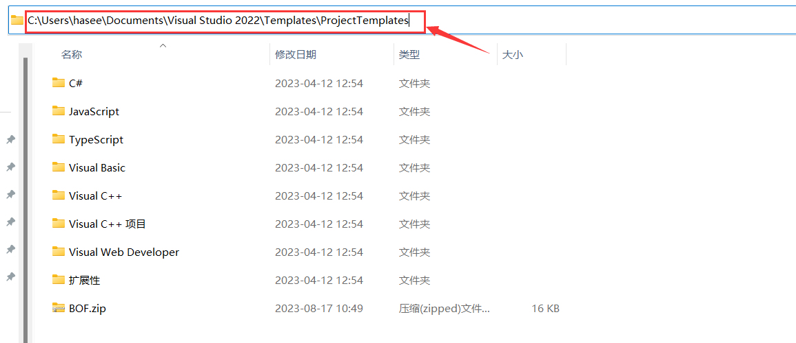
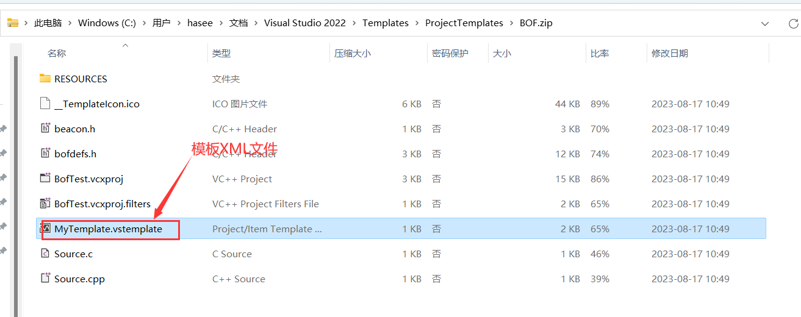

# 简介

Visual Studio 项目模板是预先定义的项目结构和设置，可以帮助开发者快速启动新的项目。项目模板中可以包含预配置的文件、资源、设置和代码结构，这样开发者在创建新的项目时就不必从零开始。

以下是Visual Studio项目模板的一些核心点：

1. **项目结构**: 模板提供了一个预定义的文件和文件夹结构，从而使得开发者可以按照一定的规范和最佳实践进行开发。
2. **预设代码**: 许多模板带有预写的代码，这样开发者可以直接进入特定类型项目的核心开发，而无需处理基础的启动代码。
3. **自定义参数**: 模板中可以定义某些参数，这些参数在创建新项目时可以被替换，从而根据开发者的需求进行个性化设置。
4. **资源和配置**: 除了代码，模板还可以包含图标、图像、配置文件等其他资源。
5. **多种类型**: Visual Studio 包含了多种默认的项目模板，例如 Windows Forms、ASP.NET Web Application、Console Application 等，同时开发者也可以根据需要创建和共享自己的自定义模板。
6. **可扩展性**: 第三方或社区可以创建并提供自己的项目模板。例如，某些流行的框架或库可能有其自己的项目模板，以便开发者能够快速开始使用。
7. **模板文件**: 项目模板通常保存为 `.vstemplate` 文件格式，这是一个 XML 文件，描述了模板的内容和行为。
8. **分布与共享**: 开发者可以创建自己的模板并将其与团队或社区共享。Visual Studio的“扩展和更新”功能也使得开发者可以轻松地从其他开发者那里获取新的项目模板

# 步骤

## 1.导出模板

当你设置完你项目模板所需的文件及代码时，点击上方菜单栏的`项目->导出模板`

选择`项目模板`

	

填写项目模板名称、描述以及文件输出位置，勾选上`自动将模板导入VisualStuido`

	

随后模板文件会输出至两个目录，例如此处我的是`C:\Users\hasee\Documents\Visual Studio 2022\My Exported Templates`和`C:\Users\hasee\Documents\Visual Studio 2022\Templates\ProjectTemplates`，因为之前勾选了`自动模板导入VS`，所以才将模板文件输出至后者目录

					

	

## 2.模板文件解释

后缀为vstemplate的文件即为模板的属性文件

打开它可以发现其使用的是xml语言，这里我简要描述几个重要的标签

- `<Name>`: 模板的名称
- `<Description>`:模板的描述
- `<ProjectType>VC</ProjectType>`：这定义了模板的项目类型是Visual C++

- `<ProjectItem ReplaceParameters="false" TargetFileName="beacon.h">beacon.h</ProjectItem>`：表示新项目将包含一个名为`beacon.h`的文件，该文件将从模板的`beacon.h`文件中复制

## 3.使用模板创建项目

创建项目时选着对应的项目模板，例如此处我创建的项目模板名称为BOF

创建完项目后就可以直接套用你设定好的文件及代码了

​	

# 参考链接	

- https://www.cnblogs.com/metahuber/p/vs-project-template.html	

​	