# 简介

Internet Information Services (IIS) 是一个由微软公司创建和维护的，用于在Windows系统上托管网站和Web应用程序的服务器。IIS是Windows Server的一个组成部分，并且也可以在某些版本的Windows上运行。

IIS支持多种Web开发技术，包括ASP.NET、PHP和静态HTML页面。IIS中还包含了一些其他的功能，例如FTP服务器、SMTP电子邮件服务器以及用于管理和维护Web服务器的工具。

# IIS服务器搭建

在“服务器管理器”中，点击“添加角色和功能(Add roles and features)”

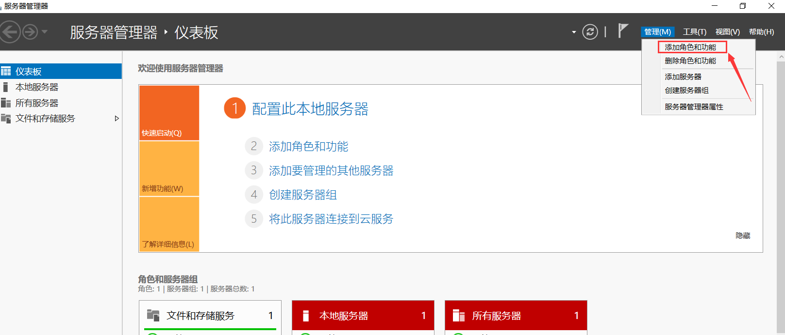	

在“添加角色和功能向导”中，点击“下一步(Next)”并选择“角色或功能基于的安装(Role-based or feature-based installation)”

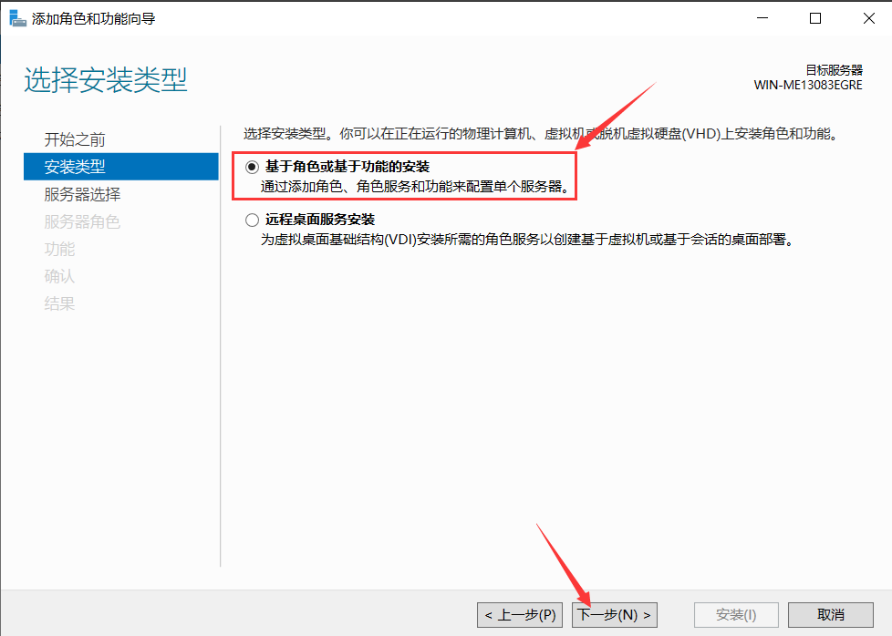	

选择你的服务器（通常它已经被选中），然后点击“下一步”	

 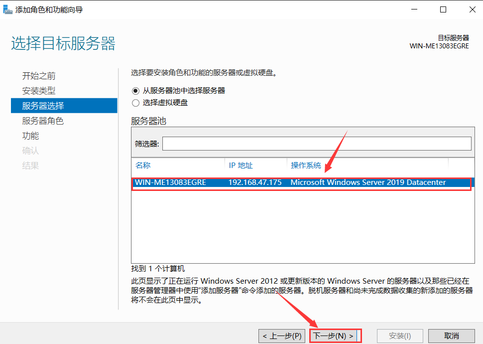		 

在角色列表中，找到并选择“Web服务器(IIS)”，然后会弹出一个新的窗口要求添加一些功能，尽量能添加上的都添上，应用程序开发必须要勾上，否者无法运行asp，然后点击“下一步”

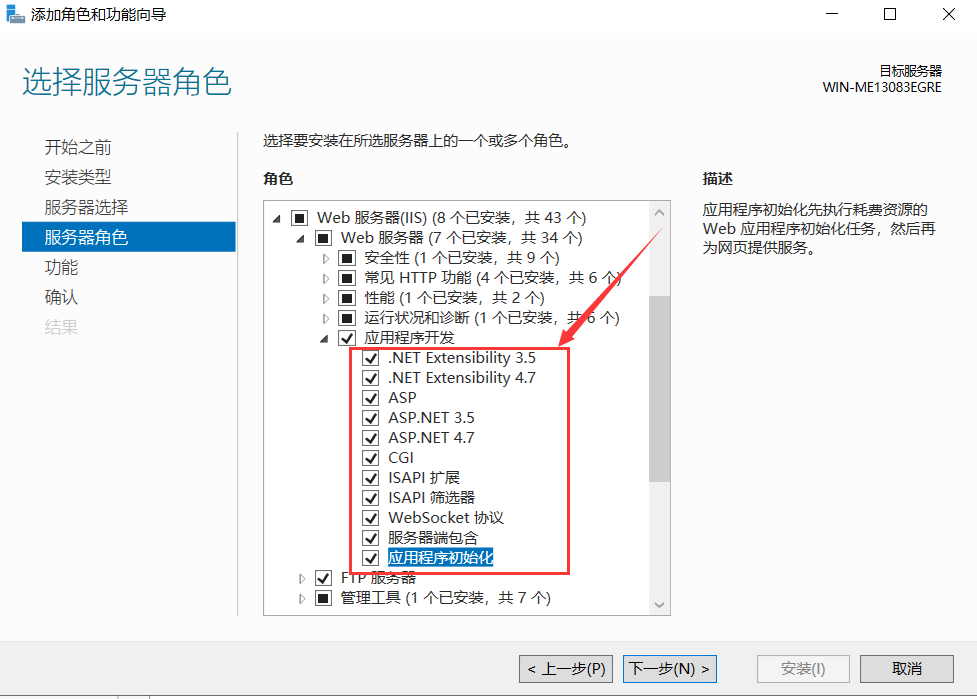	

在功能列表中，选择“.NET Framework 3.5 Features”以及“.NET Framework 4.7 Features”（或者你需要的其他版本），然后点击“下一步”

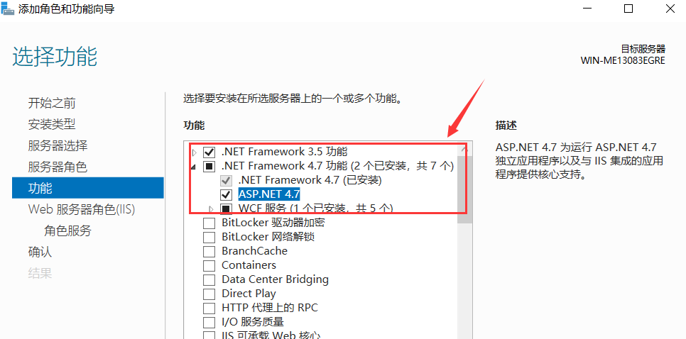		

确认你的选择，然后点击“安装(Install)”开始安装，安装完成后，你可能需要重新启动服务器

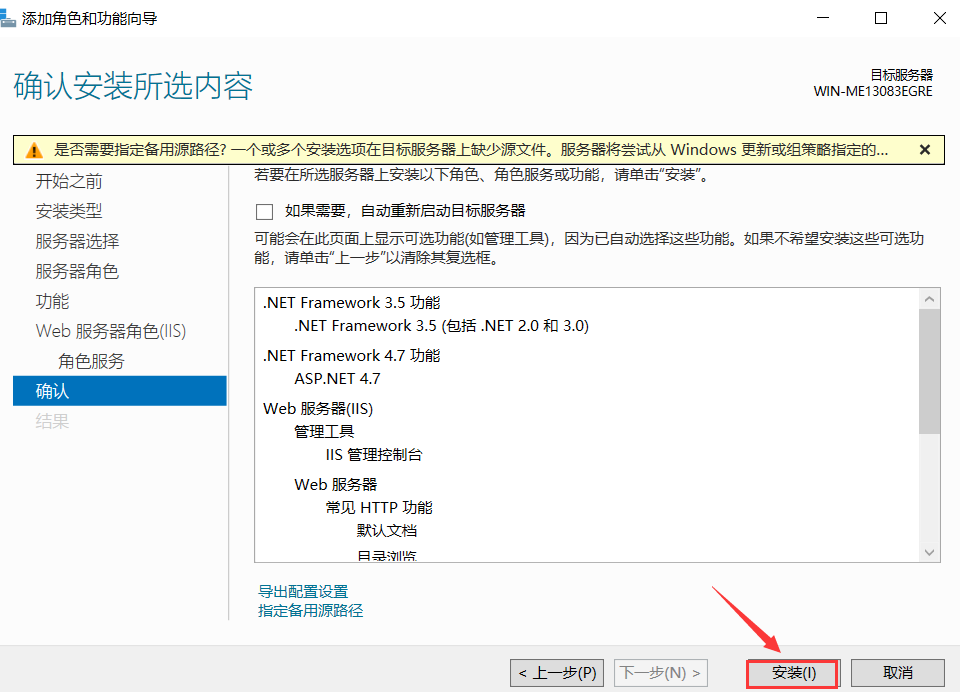	

IIS服务器安装成功如下图所示

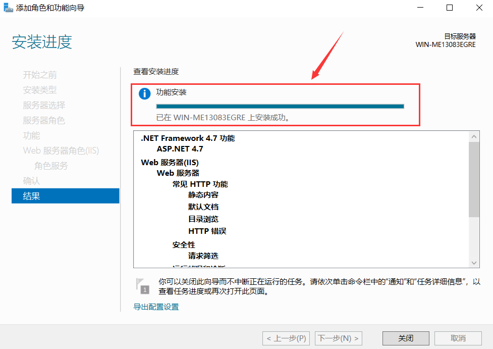	

# 搭建asp网站

打开服务器管理器，点击右上角的【IIS管理器】。

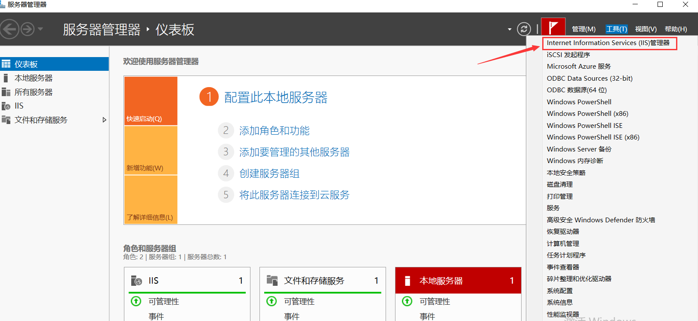

​			

在左边连接栏中，展开左侧的内容，找到【Default Web Site】，右键选择【编辑绑定】

​	

在弹出的【网页绑定】中选中里面的内容，点击【编辑】

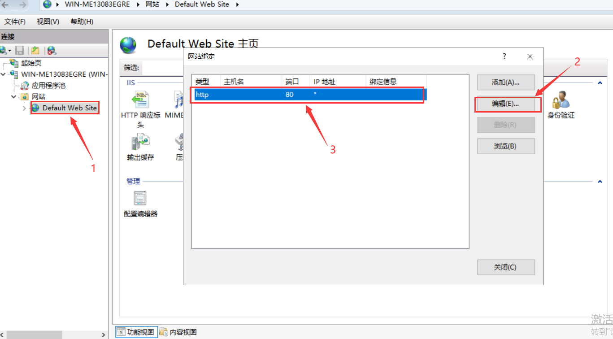

打开【编辑网站绑定】，将IP地址设置为WindowsServer的主机IP，例如此处我是192.168.47.175

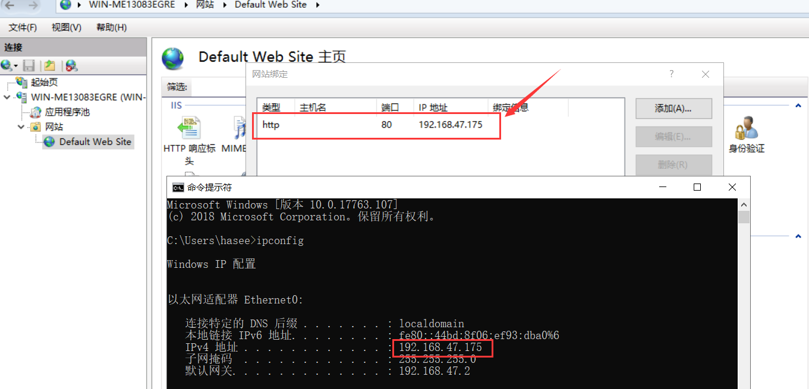

访问IIS网站`http://192.168.47.175`, 出现如下界面代表搭建成功

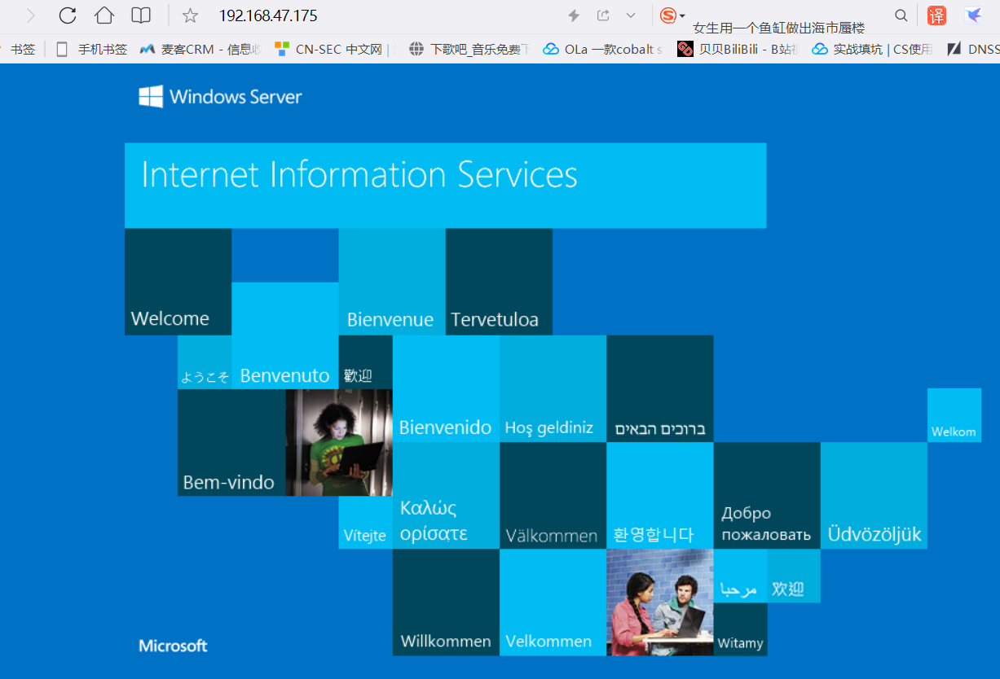

通过查看网站的高级设置可以看到其根目录，如此处我的网站根目录是`C:\inetpub\wwwroot`

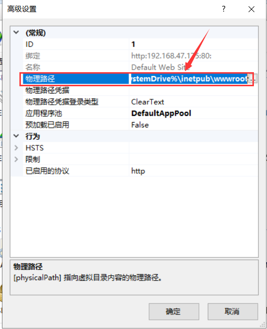	

你可以将你的网站源码放到此目录下

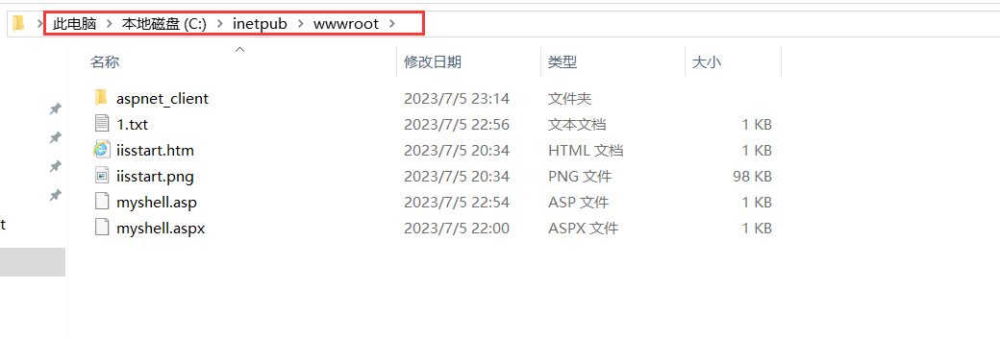

