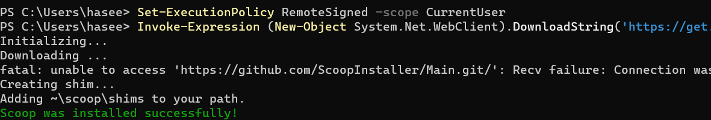
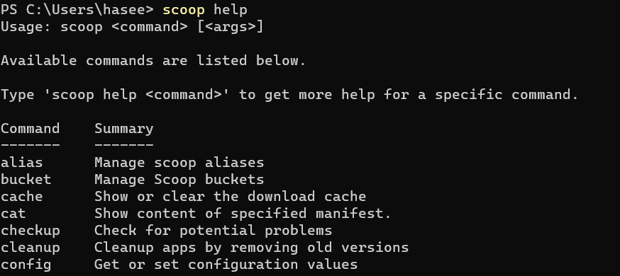

# 安装Scoop

## 什么是Scoop

Scoop是一个用于Windows操作系统的命令行软件包管理器，可以帮助用户在Windows上轻松地安装和管理各种应用程序和工具。

使用Scoop，用户可以通过PowerShell命令行安装、更新和卸载软件包。Scoop支持从多个存储库安装软件包，例如官方存储库和社区维护的存储库。用户还可以使用Scoop创建自己的私有存储库，以便在自己的电脑或网络中共享软件包


## 安装步骤

打开 PowerShell 终端，以普通用户身份运行如下命令：

> 该命令允许从互联网下载和运行 Scoop。

```powershell
Set-ExecutionPolicy RemoteSigned -scope CurrentUser
```


然后执行以下命令以下载安装程序

```powershell
Invoke-Expression (New-Object System.Net.WebClient).DownloadString('https://get.scoop.sh')
```

	


安装完成后，您可以使用以下命令验证 Scoop 是否正确安装

```
scoop help
```




​	