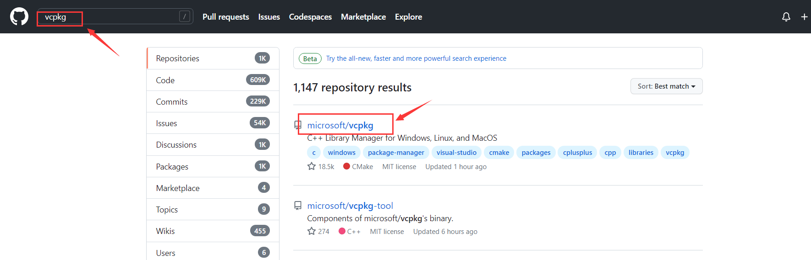
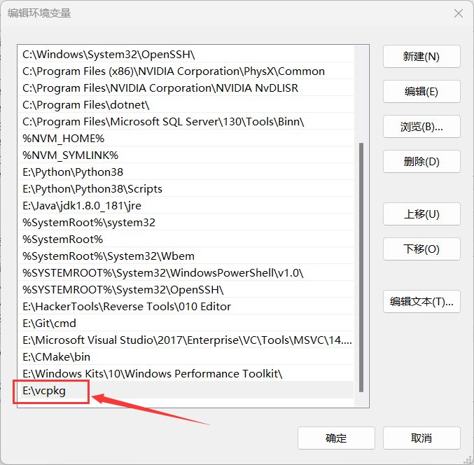
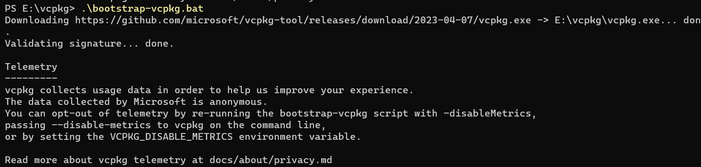
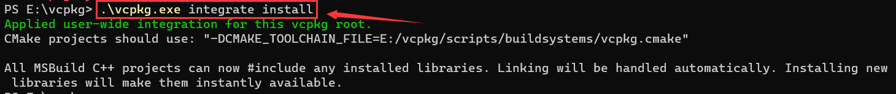
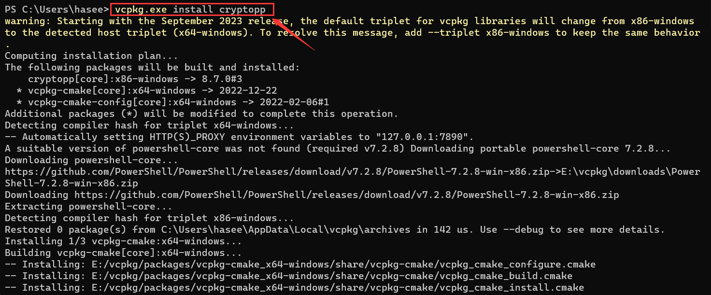

# 简介

vcpkg是一个用于在Windows系统上管理C++库的开源工具。它允许开发人员通过简单的命令行界面安装、管理和卸载各种C++库，并自动解决它们的依赖关系。

vcpkg拥有一个庞大的库集合，包括Boost、OpenCV、Qt、SDL2等等，而且不仅限于Windows平台，还支持在Linux和macOS上进行交叉编译。

使用vcpkg可以大大简化C++开发中的依赖管理问题，使得在不同项目之间使用不同版本的库变得更加容易。此外，vcpkg还可以方便地集成到CMake等构建工具中，从而使得项目的构建更加自动化和可靠


# 安装步骤

## 1.github下载

打开github网站搜索vcpkg, 将其下载至电脑

	


## 2.配置环境变量

vcpkg下载完成后，将其解压至指定目录(此处我解压至E盘的根目录)，并为其配置环境变量

	


## 3.开始安装

进入vcpkg的所在目录，命令行界面运行`bootstrap-vcpkg.bat`




如下命令将`vcpkg`集成到Visual Studio开发环境中。执行此命令后，您安装在`vcpkg`中的库将自动在Visual Studio中可用，无需手动配置库路径和包含路径

```
vcpkg intergrate install
```




## 4.安装指定的库

vcpkg安装完成后，即可开始安装其他第三方库了，例如此处我安装crytopp库:`vcpkg install cryptopp`, 在不指定库的位数的情况下，默认安装的库是32位的，若要安装64位的库可以使用这条命令：`vcpkg install cryptopp:x64-windows`



