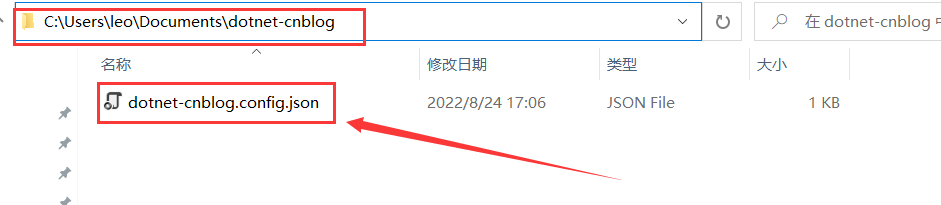

# 简介

`Dotnet-cnblog`工具可以配合typora实现自动上传md文件里图片到博客园的图床，这样就不用自己一张张来上传

 

# 安装过程

## 1.配置NET环境

**net环境下载地址**：https://dotnet.microsoft.com/zh-cn/download/dotnet/5.0

下载后安装NET环境，运行cmd命令: `dotnet --info`查看是否安装成功

	

 

## 2.安装dotnet-cnblog

执行cmd命令: `dotnet tool install --global dotnet-cnblog`

这里我已经安装过了

	

 

## 3.配置博客信息

执行cmd命令: `dotnet-cnblog`

由于博客园MetaWeblog更新了, 从而导致输入的密码不能是博客园的登录密码,而是要输入MetaWeblog的token

打开博客园的后台设置查看token

 

## 4.自动上传图片	

打开你要上传的md文件所在目录,鼠标右键打开PowerShell窗口

 

执行PowerShell命令`dotnet-cnblog.exe proc -f ".\逆向调试符号.md"`上传图片, 执行完毕后会在原md文件所在目录下生成新的md文件, 新的md文件里面的图片链接都是转化好了的

只需将生成的md文件里的代码复制粘贴到博客园就行了,不过有些时候图片上传并不能完全上传, 有些需要自己手动上传

 

## 5.卸载dotnet-cnblog

执行cmd命令: `dotnet tool uninstall --global dotnet-cnblog`

 

# 安装错误

若安装过程出现如下错误, 请删除系统文档目录下的`dotnet-cnblog.config.json`

 

然后执行cmd命令`dotnet-cnblog reset`, 重新配置博客信息

​	

​	

​			

