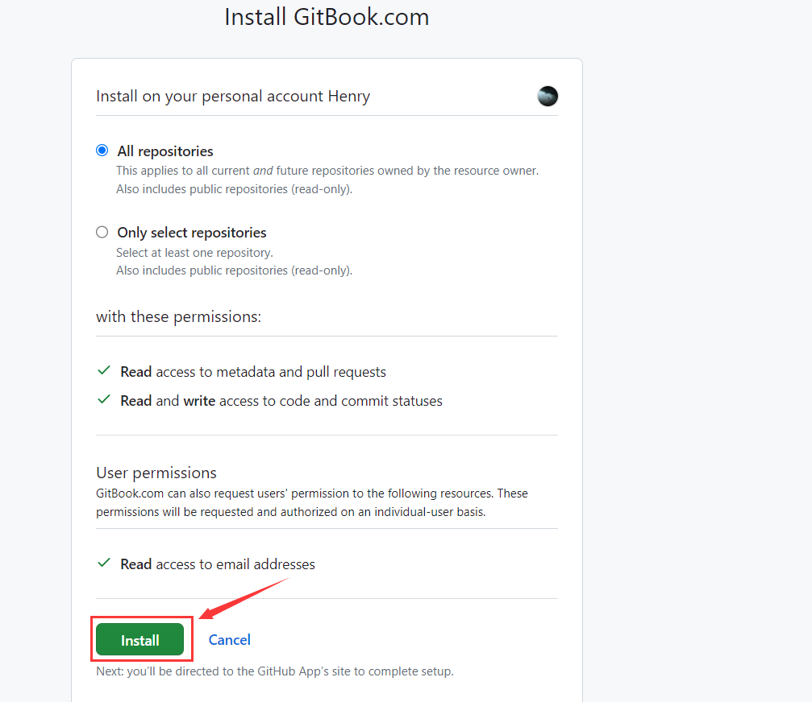

# 简介

Gitbook 是一个平台，允许用户创建和分享内容丰富的在线书籍。它有一个用户友好的界面，可以快速地写作、编辑和发布你的电子书。这里是一个按照 Gitbook 的基本步骤

# 与github同步

## 1.创建space

打开[GitBook官网](https://www.gitbook.com)，这里我选择使用github账号来登录，当然你也可以自己新建一个账号

点击左下角的加号，选择`New space`创建一个新的Gitbook空间

## 2.安装github插件

点击上方的`integrations`，随后选择`Github Files`

点击`Install`安装github的插件

				

安装完插件后，需点击`Authorize`授予gitbook与github同步的权限，随后会弹出一个浏览框(可能需登录你的github)，点击`Authorize GitbookIO`

	

	

## 3.同步github

返回space页面，点击`Sync with Github`，表示此space要与github同步

在`Synchronize with Git`的`Provider`处，勾选上`Github`

	

在`Configuration`处，点击`Connect with Github`，随后选择`Install Github application`

	

	

弹出页面让你安装Gitbook，点击`Install`

	

选择你的Github账户、仓库以及分支，随后点击`synchronize`开始同步

	

	

同步完成如下图所示

	

## 4.生成space的url

在space可以看到，github文章的内容同步到gitbook来了，若想让别人看到，还需点击右上角的`Share`

在`Publish to the web`处勾选上`Publish this space to the web`，随后它会生成你笔记的url链接，例如此处我是https://aptboys.gitbook.io/demo1

				

访问生成的url链接，效果如下图所示

			

# 博客搭建指南

## 1.自定义域名

点击你创建的组织的设置选项，例如此处我创建的组织为AptBoys，我就点击`AptBoys Settings`

在General选项块处找到`Custom domain`，点击`Edit domain`自定义你博客的域名

		

填写你的三级域名, 例如此处我的是`www.henry666.xyz`，域名`henry666.xyz`是我在godaddy上申请的(不用域名备案)

		

将DNS记录的字段及其对应的值添加至你域名的DNS管理记录中, 此处需添加的dns记录是CNAME类型的www, 指向gitbook网址

	

最后一步是验证你的域名是否正确配置

		

## 2.发表博客内容

创建`Collection`，可用于存放多个space，这样方便与github仓库的文章进行同步

		

将创建的集合发布到Web上

	

接下来这一步十分重要，需将集合内的space发布在Web上，此处选择`Publish in collection`	

最终博客效果如下图所示:

## 3.设置域名默认页面

转到设置页面, 找到`Default Content`，点击`Change default content`修改域名默认页面

选择你之前创建的Collection

				

当你访问你的域名时，则会跳转至`Collection`页面。比如我访问我的域名`www.henry666.xyz`，它会自动跳转至`www.henry666.xyz/henryblog/`

	

## 4.界面设置

点击`Collection Customization`自定义博客界面, 在`Title&Icon`可以设置你的博客标题和显示图标, 在左边栏可以实时看到修改后的博客界面

`Default space`可以设置博客的默认space, `Themes`设置博客主题

			

在`Configure`处可勾选上`Enable lens semantic search`, 用于启动AI搜索引擎

​	

## 注意事项

1.github仓库的markdown文件名最好不要有空格，换句话来说你存放图片的文件目录不能是有空格的，这样你的图片文件是无法在页面上显示的

2.后面遇到再写吧，嘻嘻

# End

​	

