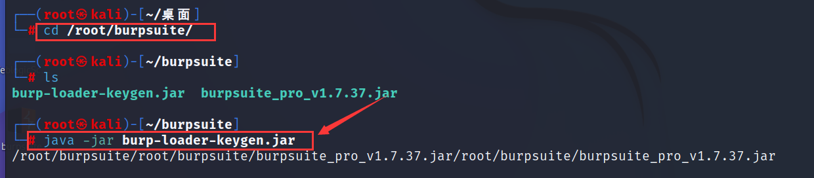
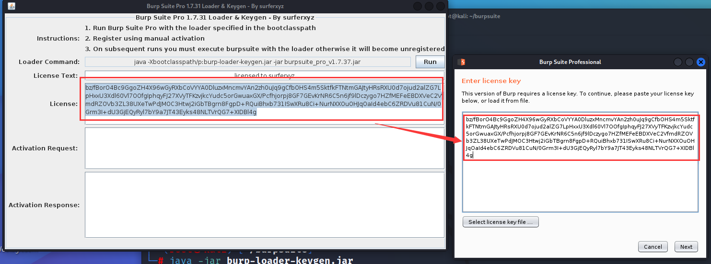
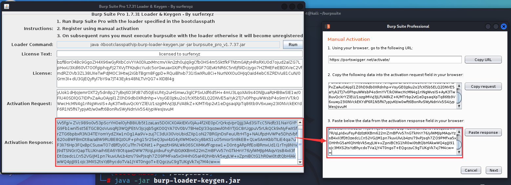

# 注意事项

## 1.注意linux位数

安装jdk之前先输出`uname -a`，看看kali linux是32位的还是64位，例如此处我的kali是32位的，因此需下载的是32位的jdk


## 2.jdk版本

jdk版本最好是oracle的，若使用的是openjdk很可能会出现burpsuite闪退现象


# 安装JDK

## 1.解压jdk

将jdk压缩包解压至kali的`/opt`目录

```
zxvf jdk-8u371-linux-i586.tar.gz /opt/
```


进入`/opt`目录，将文件目录名修改为jdk

```
cd /opt
mv jdk-8u371-linux-i586 jdk
```


## 2.添加环境变量

通过修改`/etc/profile`文件添加环境变量，在其末尾处添加如下代码。修改完后输入`source /etc/profile`，让刚添加的环境变量立即生效

```
#install JAVA JDK
export JAVA_HOME=/opt/jdk
export CLASSPATH=.:${JAVA_HOME}/lib
export PATH=${JAVA_HOME}/bin:$PATH
```

	


## 3.设置系统默认java

如下命令使用`update-alternatives`工具在Linux系统中为Java和Javac注册并设置版本。前两个命令分别注册Java和Javac的可选版本，后两个命令设置系统默认使用的Java和Javac版

```
update-alternatives --install /usr/bin/java java /opt/jdk/bin/java 1
update-alternatives --install /usr/bin/javac javac /opt/jdk/bin/javac 1
update-alternatives --set java /opt/jdk/bin/java
update-alternatives --set javac /opt/jdk/bin/javac
```


## 4.判断java是否安装成功

输入`java -version`，若出现如下图所示的版本号，则代表安装成功

	


# 破解步骤

## 1.解压burpsuite

将burpsuite的两个文件解压至`/root/burpsuite`目录

	


## 2.启动破解器

进入burpsuite所在目录，输入如下命令启动破解器

```
java -jar burp-loader-keygen.jar
```




## 3.具体流程

点击run

	


将左边`License`的内容复制到右边的框中，点击`next`




点击`Manual activation`

	


将右边的`CopyRequest`框的内容复制到左边的`ActivationRequest`框中，随后在左边的`ActivationResponse`框会生成一串内容


将这串内容复制到右边的`Paster response`框中，点击next




破解完成，可以正常使用BurpSuite了

			

​		


# 添加桌面快捷方式

## 1.创建启动器

鼠标右键kali桌面，点击`创建启动器`

	


## 2.编辑启动器

名称输入`burpsuite`，命令输入`java -Xbootclasspath/p:/root/burpsuite/burp-loader-keygen.jar -jar /root/burpsuite/burpsuite_pro_v1.7.37.jar`	，工作目录输入`/root/burpsuite`

	


图标选择kali自带的burpsuite即可

	


## 3.运行测试

运行效果如下图所示：


# 添加快捷命令

## 1.创建`usr/bin/burpsuite`

进入`usr/bin`目录，新建一个`burpsuite`文件

```
cd usr/bin
vim burpsuite
```


## 2.编辑burpsuite文件内容

burpsuite文件内容为：`java -Xbootclasspath/p:/root/burpsuite/burp-loader-keygen.jar -jar /root/burpsuite/burpsuite_pro_v1.7.37.jar`


## 3.赋予可执行权限

赋予`burpsuite`文件可执行权限：`chmod +x burpsuite`

	


## 4.运行测试

之后在终端直接输入`burpsuite`即可运行


​	

​	


​	