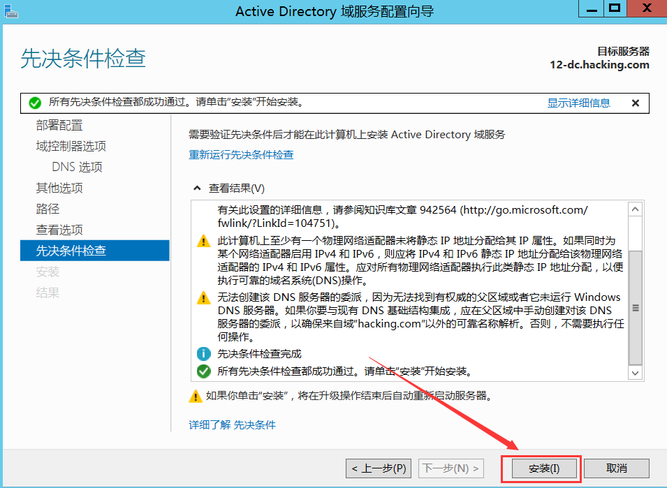
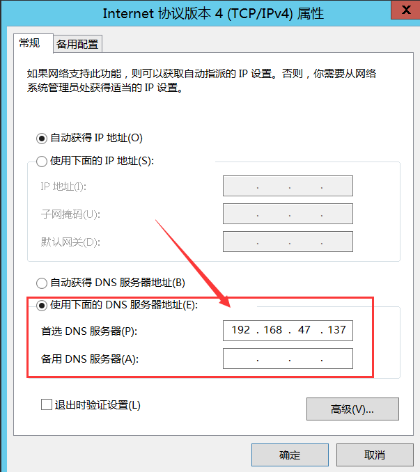

# 搭建域服务器

## 1.安装域控

打开服务器管理器, 点击右上角的管理, 选择`添加角色和功能`

	

 

一直点击下一步,直到选择服务器角色处, 勾选`Active Directory域服务器`

 

一直下一步，然后点击安装

 

安装完毕后将此服务器提升为域控制器

 

自行设置DSRM的密码, 后面一直点击下一步直至安装, 安装成功后会自行重启

	

	

 

## 2.域添加普通用户

重启后查看`Active Directory用户和计算机`,并在新建的域下创建组织单位

	

	

		

 

在新建的组织单位创建新用户, 此处创建用户名为`demo1`, 并设置密码

	

		

		

 

设置域控管理密码永不过期, cmd输入命令:`net accounts /maxpwage:unlimited`， 随后在本地安全策略验证是否设置成功

	

	

 

## 3.将主机加入域内

设置网卡的dns服务器为域控服务器ip地址, 此处域控的ip地址为`192.168.47.137`

		

 

将主机名`demo1`添加到域`hacking.com`内,随后需输入域管理员的账号和密码,

	

`

	

 

主机重启后输入在域控设置好的普通用户的账号和密码进行登录

	

 

转到域控主机查看`Active Directory用户和计算机`, 即可查看到刚加入域的计算机名

	

​										

# 卸载域控服务器

在ECS升级为域控服务器后, 若要将其卸载掉则需要进行降级处理

 

## 1.域控降级

打开`服务器管理器`, 点击右上角的管理的`删除角色和功能`

	

 

在服务器角色页面点击`Active Directory域服务器`, 随后点击`删除功能`

	

	

 

此时会弹出无法删除的提示框, 需对域控服务器降级才能删除

	

 

由于我这里的域只有一台域控,所以要勾选上`域中的最后一个域控制器`

	

	

 

删除DNS区域以及应用程序分区

	

 

输入本地管理员的账号和密码, 然后点击降级

	

	

 

## 2.重启验证

删除完成后会自动重启电脑, 此时查看可发现域服务器消失不见了

​	

​	

​						

​	